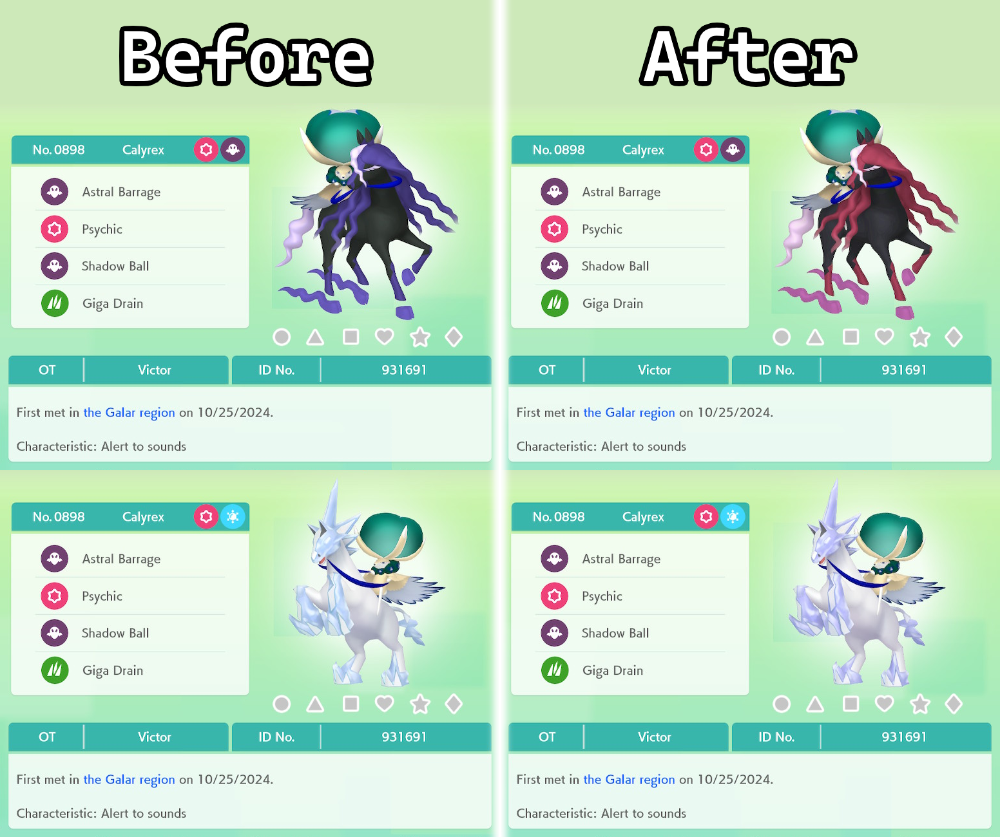

# 
# True Shiny Ice and Shadow Rider Calyrex
A simple texture mod for Pokémon Home that makes Calyrex's Ice Rider and Shadow Rider forms have both Pokémon shiny.  

I noticed while looking through renders for my other [mod](https://github.com/wishtag/home-noticeable-antique-and-masterpiece-forms) that the shiny versions of Calyrex's Ice Rider and Shadow Rider forms only has Calyrex shiny. So for fun, I made some edits to the renders so that both Calyrex and their steeds appear shiny for the rider forms.  

Realistically, there is no use for this mod because:  
- There is no way to get Calyrex or their steeds shiny so you can't even move them into Home.  
- You can't move fused Pokémon into Home, so even if they do release a way to legitimately obtain shiny Calyrex and their steeds, you wouldn't even be able to move them into Home.    

Before installing, **make sure the release is compatible with the current version of Pokémon Home.**  

I've tested this myself on my own Pokémon Home account, so you shouldn't get banned for using it. However, if you do get banned, I take no responsibility; that's on you. Now **what you will get banned for is cheating in a shiny Calyrex Ice or Shadow Rider because, at the time of writing this, there is no way to legitimately obtain them shiny.**  
# Gallery

